# 🔒 Multi-Server Conflict Prevention Guide

## Problem Summary

When running multiple WhatsApp backend servers, you may encounter **"Stream Errored (conflict)"** errors with status code 440. This happens when multiple servers try to connect to the same WhatsApp device simultaneously.

## Root Causes

1. **Race Conditions**: Multiple servers detect an unassigned device at the same time
2. **Stale Data**: Servers using cached device data instead of fresh database state
3. **Server Restarts**: When a server restarts, it might try to reconnect to devices already handled by other servers

## Solution Implementation

### ✅ 1. Atomic Device Assignment

**File**: `railway-service/services/server/serverAssignmentService.js`

- Uses PostgreSQL atomic `UPDATE ... WHERE assigned_server_id IS NULL` to ensure only ONE server can claim a device
- Double-checks assignment before proceeding

```javascript
// ATOMIC: Only succeeds if device is still unassigned
UPDATE devices 
SET assigned_server_id = 'server-id' 
WHERE id = 'device-id' 
AND assigned_server_id IS NULL
```

### ✅ 2. Pre-Connection Ownership Validation

**File**: `railway-service/services/device/deviceManager.js`

Every connection attempt now:
1. **Validates ownership from database** (fresh data, not cache)
2. **Checks assigned_server_id matches current server**
3. **Aborts if validation fails**

```javascript
// Validate before EVERY connection
const isOwner = await validateDeviceOwnership(deviceId, serverId);
if (!isOwner) {
  logger.warn('Ownership validation failed - aborting');
  return; // SKIP this device
}
```

### ✅ 3. Strict Server Assignment Checks

**File**: `railway-service/services/server/serverAssignmentService.js`

- `shouldHandleDevice()` returns `false` for unassigned devices
- Only proceeds if `assigned_server_id === this.serverId`
- Prevents "optimistic" connections

## How It Works

### Connection Flow (Conflict-Free)

```mermaid
graph TD
    A[Device Created] --> B{Assigned?}
    B -->|No| C[Server 1 Detects]
    B -->|No| D[Server 2 Detects]
    
    C --> E[Atomic Assign to Server 1]
    D --> F[Atomic Assign Attempt]
    
    E --> G{Success?}
    F --> H{Success?}
    
    G -->|Yes| I[Server 1: Validate Ownership]
    H -->|No| J[Server 2: Device Already Assigned]
    
    I --> K{Valid?}
    K -->|Yes| L[Server 1: Connect to WhatsApp]
    K -->|No| M[Server 1: Abort]
    
    J --> N[Server 2: Skip Device]
    
    L --> O[✅ Connected - No Conflict]
    M --> P[❌ Abort - Prevent Conflict]
    N --> P
```



### Restart Behavior (Safe)

When a server restarts:
1. Reads only devices with `assigned_server_id = its_own_id`
2. Validates each device before reconnecting
3. Never touches devices assigned to other servers

## Testing & Verification

### ✅ Check for Conflicts

Monitor logs for these patterns:

**Good (No Conflict):**
```
✅ Device ownership validated
🔌 Connecting to WhatsApp
✅ Device connected successfully
```

**Prevented Conflict:**
```
⚠️ Ownership validation failed - assigned to different server
🚫 Final ownership check failed - aborting connection
📋 Device belongs to different server - skipping
```

**Bad (Conflict - Should Not Happen):**
```
⚠️ CONFLICT detected (440) - Multiple connections
Stream Errored (conflict)
```

### SQL Query to Monitor Assignments

```sql
-- Check device distribution across servers
SELECT 
  assigned_server_id,
  COUNT(*) as device_count,
  COUNT(*) FILTER (WHERE status = 'connected') as connected_count
FROM devices
GROUP BY assigned_server_id
ORDER BY device_count DESC;

-- Find devices with recent conflicts
SELECT 
  id, 
  device_name, 
  assigned_server_id, 
  status, 
  updated_at
FROM devices
WHERE updated_at > NOW() - INTERVAL '15 minutes'
AND status = 'disconnected'
ORDER BY updated_at DESC;
```

## Restart Procedures

### ✅ Safe Restart (No Conflicts)

```bash
# Restart individual server
pm2 restart whatsapp-server-1

# Restart all servers (staggered)
pm2 restart whatsapp-server-1
sleep 10
pm2 restart whatsapp-server-2
sleep 10
pm2 restart whatsapp-server-3
```

### ✅ Force Reassignment (If Needed)

If you need to manually reassign devices:

```sql
-- Reassign specific device to server
UPDATE devices 
SET assigned_server_id = 'new-server-id',
    updated_at = NOW()
WHERE id = 'device-id';

-- Clear stuck assignments (use carefully!)
UPDATE devices 
SET assigned_server_id = NULL,
    status = 'disconnected',
    updated_at = NOW()
WHERE assigned_server_id = 'dead-server-id';
```

## Troubleshooting

### Issue: Still Getting Conflicts

**Solution:**
1. Check all servers are running the latest code with validation
2. Verify `serverAssignmentService.serverId` is unique per server
3. Check database `assigned_server_id` values are correct

```bash
# Check server IDs
pm2 logs whatsapp-server-1 | grep "serverId"
```

### Issue: Devices Not Connecting

**Solution:**
1. Check device `assigned_server_id` matches a running server
2. Verify server health in `backend_servers` table
3. Check if server is marked `is_active = true`

```sql
SELECT * FROM backend_servers WHERE is_active = true;
```

### Issue: Server Keeps Stealing Devices

**Solution:**
1. Ensure `SERVER_NAME` and hostname are unique per server
2. Check `.env` has correct `SERVER_URL` for each server
3. Verify no duplicate `server_url` in `backend_servers` table

## Best Practices

1. **✅ Unique Server IDs**: Each server must have unique hostname/port
2. **✅ Staggered Restarts**: Don't restart all servers simultaneously
3. **✅ Monitor Assignments**: Regularly check device distribution
4. **✅ Health Checks**: Ensure `updateServerHealth()` runs periodically
5. **✅ Load Balancing**: Let system auto-assign based on capacity

## Configuration Checklist

- [ ] Each server has unique `SERVER_NAME` in `.env`
- [ ] Each server has unique `SERVER_URL` (include port if needed)
- [ ] `SERVER_MAX_CAPACITY` is set appropriately per server
- [ ] All servers using latest code with ownership validation
- [ ] Database `backend_servers` table has no duplicate URLs
- [ ] Server health checks are running (check `last_health_check`)

## Summary

This implementation prevents conflicts by:
1. **Atomic assignments** - only one server can claim a device
2. **Strict validation** - always check ownership before connecting
3. **Fresh data** - always query database, never use stale cache
4. **Explicit skipping** - if not owner, skip immediately

**Result**: Zero conflicts, even with multiple servers and restarts! 🎉
